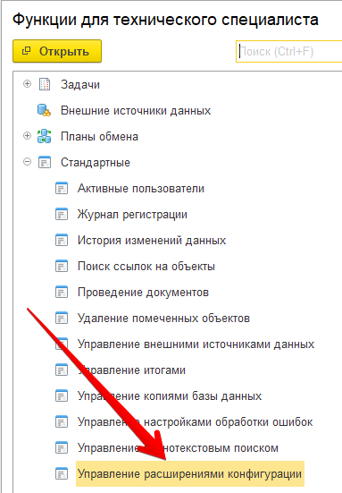

О расширении
============

Описание
--------

Программное решение распространяется в виде набора расширений конфигурации 1С. Расширения предназначены для устранения рутинных операций при работе бухгалтера с сервисом Тревел.

На данный момент в программе реализован механизм автоматической выгрузки сотрудников в сервис.

Поддерживаемые конфигурации
~~~~~~~~~~~~~~~~~~~~~~~~~~~

На данный момент поддерживаются следующие конфигурации:

* Бухгалтерия предприятия, редакция 3.0
* Бухгалтерия предприятия КОРП, редакция 3.0

Платформа 1С. Минимальные требования
~~~~~~~~~~~~~~~~~~~~~~~~~~~~~~~~~~~~

Для полноценной работы модуля необходима платформа не ниже версии **8.3.14**

Загрузка модуля
~~~~~~~~~~~~~~~

Расширения можно скачать по ссылкам: 
* `Базовое расширение Тревел для 1С <https://kontur.trevel/>`_
* `Расширение Тревел для конфигурации Бухгалтерия предприятия, редакция 3.0 <https://kontur.trevel/>`_

Установка
---------

Решение поставляется в виде двух расширений (файлов) 1С. Для каждого необходимо пройти последовательность действий. Для установки потребуется *монопольный доступ*.

Рассмотрим типовой сценарий установки расширения

*Шаг 1.* Необходимо загрузить файл расширения

*Шаг 2.* Далее переходим в «Управление расширениями конфигурации»

.. figure:: _static/sshts/01.png
      :scale: 100%
      :align: center
      :alt: Функции для технического специалиста...

      Для начала следует в основном меню выбрать пункт «Функции для технического специалиста...»

.. note:: Если у вас данный пункт отсутствует, то либо недостаточно прав, либо его необходимо активировать в настройках.

      Затем перейти в раздел «Управление расширениями конфигурации»

*Шаг 3.* В открывшемся окне будет отображен список с текущими установленными расширениями. Добавим новое расширение нажатием на соответствующую кнопку.

.. figure:: _static/sshts/03.png
      :scale: 100%
      :align: center

      Выбор файла расширения

*Шаг 4.* Осуществим первичную настройку. Для этого необходимо снять галочки «Безопасный режим», «Защита от опасных действий» и установить «Использовать основные роли»

.. note::   **Безопасный режим** - запрещает расширению использовать интернет и работать с файлами на сервере.
            
            **Защита от опасных действий** - показывает предупреждения, при попытке опасных действий (работой с программами на компьютере).
            
            **Использовать основные роли** - расширение будет доступно всем пользователям.

*Шаг 5.* Повторить шаги 1-4 для второго расширения

*Шаг 6.* Для активации добавленных расширений необходимо перезапустить программу.

Использование
-------------

Перед началом использования необходимо задать настройки подключения к сервису.
Детали подключения необходимо получить в сервисе.

Настройка подключения
~~~~~~~~~~~~~~~~~~~~~

После перезапуска в панели разделов должен появиться новый пункт «Тревел». Кликнем по нему. 
В содержимом подраздела будет ссылка на справочник настроек. Откроем справочник и создадим новую настройку.
Заполним поля настройки сведениями, выданные сервисом.

.. figure:: _static/sshts/04.png
      :scale: 100%
      :align: center

      Создание новой настройки подключения

После сохранения настройки можно приступать к работе с сервисом.

Выгрузка сотрудников
~~~~~~~~~~~~~~~~~~~~

ЧаВО
----
1. *Можно ли работать с модулем в 1cfresh.com?*
 Сейчас мы не поддерживаем работу в 1cfresh.com

2. *Можно работать с модулем в облачной 1С?*
 Если вы работаете в 1с из приложения для персонального компьютера, или через удаленный рабочий стол - это возможно.
