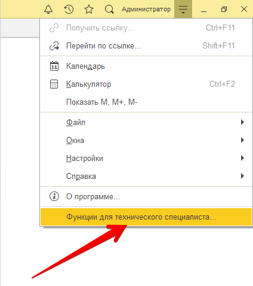

О расширении
============

Описание
--------

Программное решение распространяется в виде расширения конфигурации 1С. Расширение предназначено для устранения рутинных операций при работе бухгалтера с сервисом Тревел.

Поддерживаемые конфигурации
~~~~~~~~~~~~~~~~~~~~~~~~~~~

На данный момент поддерживаются следующие конфигурации:

* Бухгалтерия предприятия, редакция 3.0
* Бухгалтерия предприятия КОРП, редакция 3.0

Платформа 1С. Минимальные требования
~~~~~~~~~~~~~~~~~~~~~~~~~~~~~~~~~~~~

Для полноценной работы модуля необходима платформа не ниже версии **8.3.14**

Загрузка модуля
~~~~~~~~~~~~~~~

Модуль можно скачать по ссылке: `Интеграционный модуль Тревел для 1С <https://kontur.trevel/>`_

Установка
---------

Рассмотрим типовой сценарий установки расширения

*Шаг 1.* Необходимо загрузить файл расширения

*Шаг 2.* Далее переходим в «Управление расширениями конфигурации»

      Функции для технического специалиста...

ЧаВО
----
1. *Можно ли работать с модулем в 1cfresh.com?*
 Сейчас мы не поддерживаем работу в 1cfresh.com

2. *Можно работать с модулем в облачной 1С?*
 Если вы работаете в 1с из приложения для персонального компьютера, или через удаленный рабочий стол - это возможно.

----

Навигация
~~~~~~~~~

* :ref:`genindex`
* :ref:`modindex`
* :ref:`search`
