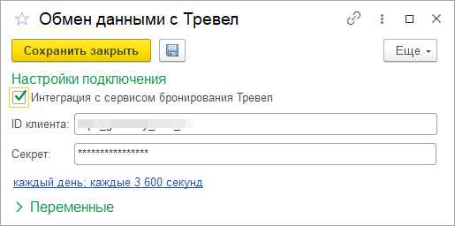

О расширении
============

Описание
--------

Программное решение распространяется в виде набора расширений конфигурации 1С. 
Расширения предназначены для устранения рутинных операций при работе бухгалтера с сервисом Тревел (далее сервис).

Вы можете автоматически выгрузить сотрудников в сервис из 1С.

Поддерживаемые конфигурации
~~~~~~~~~~~~~~~~~~~~~~~~~~~

Поддерживаются следующие конфигурации:

* Бухгалтерия предприятия, редакция 3.0
* Бухгалтерия предприятия КОРП, редакция 3.0
* ERP Управление предприятием 2

Платформа 1С. Минимальные требования
~~~~~~~~~~~~~~~~~~~~~~~~~~~~~~~~~~~~

Для полноценной работы модуля необходима платформа не ниже версии **8.3.14**

Загрузка модуля
~~~~~~~~~~~~~~~

Расширения можно скачать по ссылкам: 

* `Базовое расширение для 1С <https://update.kontur.ru/1c/v1/travel/extension>`_
* `Расширение для Бухгалтерия предприятия 3.0 <https://update.kontur.ru/1c/v1/travel_bp3/extension>`_
* `Расширение для ERP 2 <https://update.kontur.ru/1c/v1/travel_erp2/extension>`_

Установка
---------

.. video:: _static/video/install.mp4
   :width: 800
   :height: 450

Решение поставляется в виде двух расширений (файлов) 1С. Для каждого необходимо пройти последовательность действий. 
Для установки потребуется *монопольный доступ*. 

Существует несколько вариантов установки расширений.

Вариант для пользователя
~~~~~~~~~~~~~~~~~~~~~~~~

Рассмотрим пользовательский сценарий установки расширения

*Шаг 1.* Необходимо загрузить файл расширения (см. ссылки выше)

*Шаг 2.* Откройте форму списка установленных расширений: *Администрирование -> Печатные формы, отчеты и обработки -> Расширения*

*Шаг 3.* Добавьте новое расширение: *Добавить из файла... -> Выберите файл "travel.cfe" ("travel_bp3.cfe") -> Открыть*

.. image:: _static/sshts/07.png
      :align: center
      :alt: Список установленных расширений

*Шаг 4.* Снимите галочку *«Безопасный режим»*

*Шаг 5.* Повторить шаги 1-4 для второго расширения

*Шаг 6.* Для активации добавленных расширений необходимо перезапустить программу.

~~~~~~~~~~~~~~~~~~~~~~~~~~~~~~~~~~~~
Вариант для технического специалиста
~~~~~~~~~~~~~~~~~~~~~~~~~~~~~~~~~~~~

*Шаг 1.* Необходимо загрузить файл расширения

*Шаг 2.* Далее переходим в «Управление расширениями конфигурации»

.. figure:: _static/sshts/01.png
      :align: center
      :alt: Функции для технического специалиста...

      Для начала следует в основном меню выбрать пункт «Функции для технического специалиста...»

.. note:: Если у вас данный пункт отсутствует, то либо недостаточно прав, либо его необходимо активировать в настройках.

.. figure:: _static/sshts/02.png
      :align: center

      Затем перейти в раздел «Управление расширениями конфигурации»

*Шаг 3.* В открывшемся окне будет отображен список с текущими установленными расширениями. Добавим новое расширение нажатием на соответствующую кнопку.

.. figure:: _static/sshts/03.png
      :align: center

      Выбор файла расширения

*Шаг 4.* Осуществим первичную настройку. Для этого необходимо снять галочки «Безопасный режим», «Защита от опасных действий» и установить «Использовать основные роли»

.. note::   **Безопасный режим** - запрещает расширению использовать интернет и работать с файлами на сервере.
            
            **Защита от опасных действий** - показывает предупреждения, при попытке опасных действий (работой с программами на компьютере).
            
            **Использовать основные роли** - расширение будет доступно всем пользователям.

*Шаг 5.* Повторить шаги 1-4 для второго расширения

*Шаг 6.* Для активации добавленных расширений необходимо перезапустить программу.

Использование
-------------

Перед началом использования необходимо задать настройки подключения к сервису.
Детали подключения необходимо получить в сервисе.

Настройка подключения
~~~~~~~~~~~~~~~~~~~~~

После перезапуска в разделе «Администрирование» должен появиться новый пункт «Обмен данными с Контур.Тревел». Кликнем по нему. 

.. figure:: _static/sshts/08.png
      :align: center

      Обмен данными с Контур.Тревел

Заполним поля настройки сведениями, выданные сервисом. (необходимо обратиться к менеджеру сервиса)

      Заполнение настроек подключения

После сохранения настройки можно приступать к работе с сервисом.

Выгрузка сотрудников
~~~~~~~~~~~~~~~~~~~~

Для выгрузки сотрудников в сервис достаточно перейти в одноименный справочник.
В форме списка и элемента справочника должна была появиться кнопка «Тревел» |кнопка-тревел|.

.. |кнопка-тревел| image:: _static/sshts/05.png

.. note:: Перед выгрузкой необходимо убедиться, что у физических лиц заполнены:
          
          - Дата, с которой действуют сведения о гражданстве
          - Номер телефона и e-mail
          - Документ, удостоверяющий личность (например, паспорт РФ)

Выберем нескольких сотрудников (например, удерживая клавишу ``Shift`` или ``Ctrl``) и нажмем на кнопку «Тревел» -> «Синхронизировать»

.. figure:: _static/sshts/10.png
      :align: center

      Выгрузка сотрудников

Аналогично можно выгружать по одному из карточки сотрудника.

Выгрузка сотрудников по расписанию
~~~~~~~~~~~~~~~~~~~~~~~~~~~~~~~~~~

С целью автоматизации процесса отправки сотрудников в сервис, можно настроить расписание выгрузки.

Для настройки следует открыть форму с параметрами подключения (см. Настройка подключения) и активировать выключатель «Расписание»

В открывшемся окне задать параметры расписания.

.. figure:: _static/sshts/11.png
      :align: center

      Параметры выгрузки по расписанию

Частые вопросы
--------------
1. *Можно ли работать с модулем в 1cfresh.com?*
 Сейчас мы не поддерживаем работу в 1cfresh.com

2. *Можно работать с модулем в облачной 1С?*
 Если вы работаете в 1с из приложения для персонального компьютера, или через удаленный рабочий стол - это возможно.
