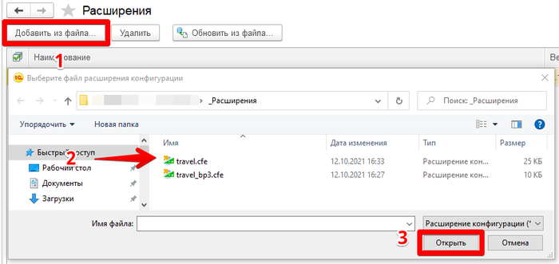
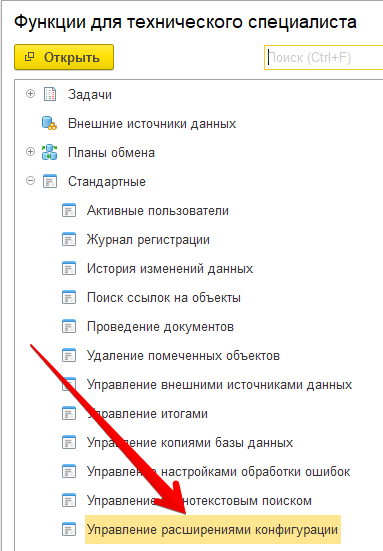
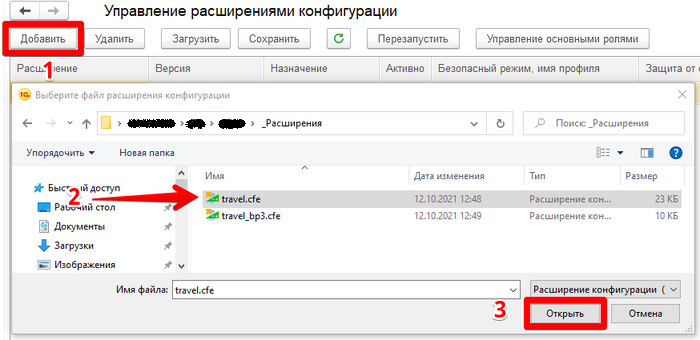

Установка
=========

.. raw:: html
   
   

      <iframe 
            width="560" 
            height="315" 
            src="https://www.youtube-nocookie.com/embed/0AkXTRNUNgc" 
            title="YouTube video player" 
            frameborder="0" 
            allow="accelerometer; autoplay; clipboard-write; encrypted-media; gyroscope; picture-in-picture" 
            allowfullscreen>
      </iframe>
    

Решение поставляется в виде расширения (файла) 1С. Для установки потребуется *монопольный доступ*. 

Существует несколько вариантов установки расширений.

Вариант для пользователя
------------------------

Рассмотрим пользовательский сценарий установки расширения

*Шаг 1.* Необходимо загрузить файл расширения (см. ссылки выше)

*Шаг 2.* Откройте форму списка установленных расширений: *Администрирование -> Печатные формы, отчеты и обработки -> Расширения*

.. image:: _static/sshts/06.png
      :align: center
      :alt: Раздел расширения

*Шаг 3.* Добавьте новое расширение: *Добавить из файла... -> Выберите файл "travel.cfe" -> Открыть*

*Шаг 4.* Снимите галочку *«Безопасный режим»*

*Шаг 5.* Повторить шаги 1-4 для второго расширения

*Шаг 6.* Для активации добавленного расширения необходимо перезапустить программу.

Вариант для технического специалиста
------------------------------------

*Шаг 1.* Необходимо загрузить файл расширения

*Шаг 2.* Далее переходим в «Управление расширениями конфигурации»

.. figure:: _static/sshts/01.png
      :align: center
      :alt: Функции для технического специалиста...

      Для начала следует в основном меню выбрать пункт «Функции для технического специалиста...»

.. note:: Если у вас данный пункт отсутствует, то либо недостаточно прав, либо его необходимо активировать в настройках.

      Затем перейти в раздел «Управление расширениями конфигурации»

*Шаг 3.* В открывшемся окне будет отображен список с текущими установленными расширениями. Добавим новое расширение нажатием на соответствующую кнопку.

      Выбор файла расширения

*Шаг 4.* Осуществим первичную настройку. Для этого необходимо снять галочки «Безопасный режим», «Защита от опасных действий» и установить «Использовать основные роли»

.. note::   **Безопасный режим** - запрещает расширению использовать интернет и работать с файлами на сервере.
            
            **Защита от опасных действий** - показывает предупреждения, при попытке опасных действий (работой с программами на компьютере).
            
            **Использовать основные роли** - расширение будет доступно всем пользователям.

*Шаг 5.* Для активации добавленного расширения необходимо перезапустить программу.