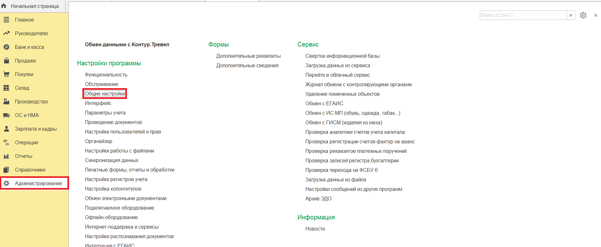
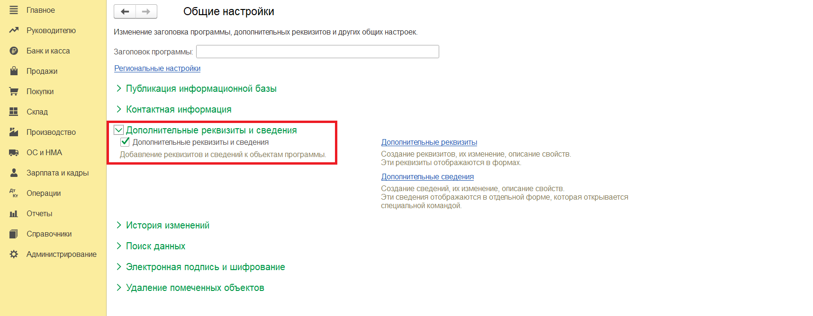
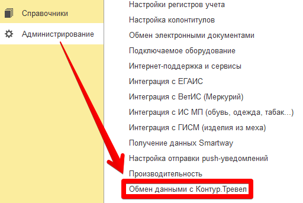
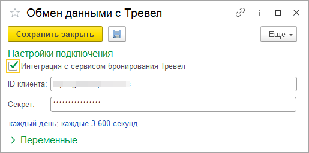
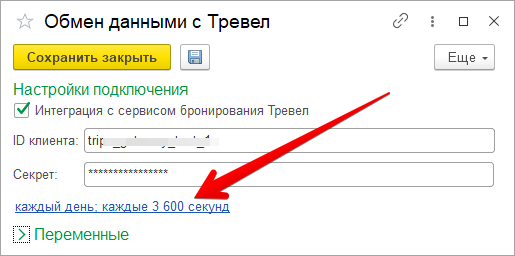
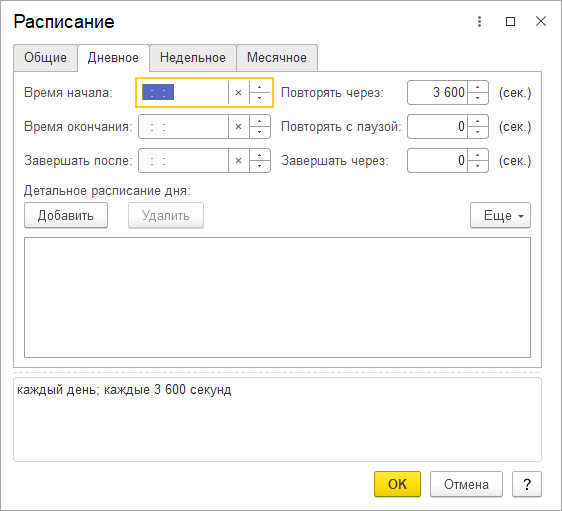
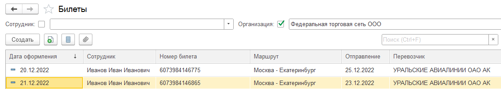
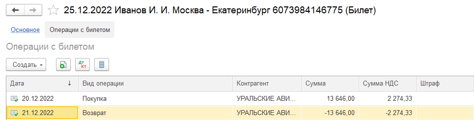
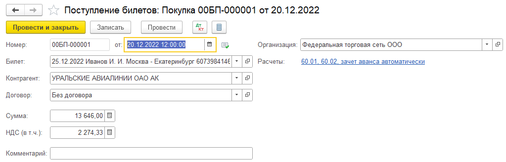
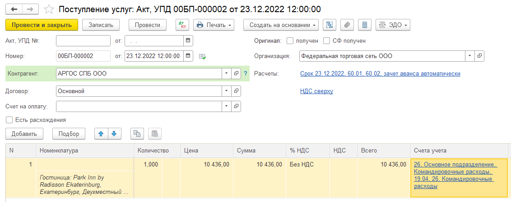

Использование
=============

Перед началом использования необходимо задать настройки подключения к сервису.
Детали подключения необходимо запросить у менеджера по сопровождению.

Начальная настройка
-------------------

Для вывода информационных сообщений в ходе выгрузки сотрудников, необходимо включить использование дополнительных реквизитов и сведений.
*Шаг 1* Откройте раздел «Администрирование — Общие настройки».

      
*Шаг 2* В подразделе «Дополнительные реквизиты и сведения» установите галочки, разрешающие добавлять эти элементы.

.. note:: Для включения использования «Дополнительных рекизитов» и сведений необходимо права администратора.

Настройка подключения
---------------------

.. raw:: html
   
   

      <iframe 
            width="560" 
            height="315" 
            src="https://www.youtube-nocookie.com/embed/hf9k3ev3eZU" 
            title="YouTube video player" 
            frameborder="0" 
            allow="accelerometer; autoplay; clipboard-write; encrypted-media; gyroscope; picture-in-picture" 
            allowfullscreen>
      </iframe>
    

После перезапуска в разделе «Администрирование» должен появиться новый пункт «Обмен данными с Контур.Тревел». Кликнем по нему. 

      Обмен данными с Контур.Тревел

Заполним поля данными, выданными менеджером по сопровождению

      Заполнение настроек подключения

После сохранения настроек модуль готов к работе.

Выгрузка сотрудников
--------------------

Для выгрузки сотрудников перейдем в справочник «Сотрудники».
В форме списка и элемента должна появиться кнопка «Выгрузить в Тревел» |кнопка-тревел|.

.. raw:: html
   
   

      <iframe 
            width="560" 
            height="315" 
            src="https://www.youtube-nocookie.com/embed/tjKyGdjW_Og" 
            title="YouTube video player" 
            frameborder="0" 
            allow="accelerometer; autoplay; clipboard-write; encrypted-media; gyroscope; picture-in-picture" 
            allowfullscreen>
      </iframe>
    

.. note:: Перед выгрузкой необходимо убедиться, что у физических лиц заполнены:
          
          - Дата, с которой действуют сведения о гражданстве
          - Номер телефона и e-mail
          - Документ, удостоверяющий личность (например, паспорт РФ)

Выберем нескольких сотрудников (например, удерживая клавишу ``Shift`` или ``Ctrl``) и нажмем на кнопку «Выгрузить в Тревел»

.. figure:: _static/sshts/10.png
      :align: center

      Выгрузка сотрудников
Информация о выгрузке отобразится в колонке «Статус выгрузки».

.. figure:: _static/sshts/119.png
      :align: center

      Информация о выгрузке сотрудника

Кнопка выгрузки также доступна в форме сотрудника.

Выгрузка сотрудников по расписанию
----------------------------------

Сразу после включения интеграции активируется фоновый обмен с расписанием по умолчанию 1 час.

Автоматически выгружаются сотрудники, которые были выгружены ранее вручную.
Таким образом, для создания новых сотрудников в сервисе необходимо осуществить выгрузку нажатием на кнопку.
Изменения по таким сотрудникам будут отправляться автоматически.

В зависимости от условий эксплуатации можно задать иные параметры расписания.

Для настройки следует открыть форму с параметрами подключения (см. Настройка подключения) и кликнуть по соответствующей ссылке.

В открывшемся окне задать параметры расписания.

      Параметры выгрузки по расписанию

Загрузка тревел-услуг
---------------------

Загрузка тревел-услуг происходит в фоновом режиме по тому же расписанию, что и выгрузка сотрудников.

В Бухгалтерии предприятия обрабатываются 2 типа тревел-услуг:

      - Авиаперелеты - на их основе будут созданы билеты и операции, связанные с ними;
      - Проживания в гостинице - служат основания для документа поступления услуг

Таким образом, после очередной загрузки в программе должны появится билеты:

      Билеты, загруженные из сервиса

а также связанные с ними операции:

      Операции с билетом

      Операция покупки билета

На основе гостиничного бронирования из сервиса будет создан документ поступления услуг:

      Гостиничное бронирование в документе поступления