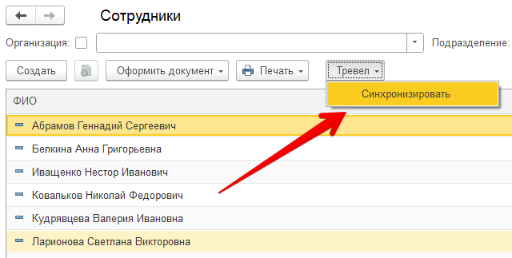

Использование
=============

Перед началом использования необходимо задать настройки подключения к сервису.
Детали подключения необходимо запросить у менеджера по сопровождению.

Настройка подключения
---------------------

.. raw:: html
   
   

      <iframe 
            width="560" 
            height="315" 
            src="https://www.youtube-nocookie.com/embed/hf9k3ev3eZU" 
            title="YouTube video player" 
            frameborder="0" 
            allow="accelerometer; autoplay; clipboard-write; encrypted-media; gyroscope; picture-in-picture" 
            allowfullscreen>
      </iframe>
    

После перезапуска в разделе «Администрирование» должен появиться новый пункт «Обмен данными с Контур.Тревел». Кликнем по нему. 

.. figure:: _static/sshts/08.png
      :align: center

      Обмен данными с Контур.Тревел

Заполним поля данными, выданными менеджером по сопровождению

.. figure:: _static/sshts/09.png
      :align: center

      Заполнение настроек подключения

После сохранения настроек модуль готов к работе.

Выгрузка сотрудников
--------------------

Для выгрузки сотрудников перейдем в справочник «Сотрудники».
В форме списка и элемента должна появиться кнопка «Выгрузить в Тревел» |кнопка-тревел|.

.. raw:: html
   
   

      <iframe 
            width="560" 
            height="315" 
            src="https://www.youtube-nocookie.com/embed/tjKyGdjW_Og" 
            title="YouTube video player" 
            frameborder="0" 
            allow="accelerometer; autoplay; clipboard-write; encrypted-media; gyroscope; picture-in-picture" 
            allowfullscreen>
      </iframe>
    

.. note:: Перед выгрузкой необходимо убедиться, что у физических лиц заполнены:
          
          - Дата, с которой действуют сведения о гражданстве
          - Номер телефона и e-mail
          - Документ, удостоверяющий личность (например, паспорт РФ)

Выберем нескольких сотрудников (например, удерживая клавишу ``Shift`` или ``Ctrl``) и нажмем на кнопку «Выгрузить в Тревел»

      Выгрузка сотрудников

Кнопка выгрузки также доступна в форме сотрудника.

Выгрузка сотрудников по расписанию
----------------------------------

Сразу после включения интеграции активируется фоновый обмен с расписанием по умолчанию 1 час.

Автоматически выгружаются сотрудники, которые были выгружены ранее вручную.
Таким образом, для создания новых сотрудников в сервисе необходимо осуществить выгрузку нажатием на кнопку.
Изменения по таким сотрудникам будут отправляться автоматически.

В зависимости от условий эксплуатации можно задать иные параметры расписания.

Для настройки следует открыть форму с параметрами подключения (см. Настройка подключения) и кликнуть по соответствующей ссылке.

.. figure:: _static/sshts/11.png
      :align: center

В открывшемся окне задать параметры расписания.

.. figure:: _static/sshts/12.png
      :align: center

      Параметры выгрузки по расписанию

Загрузка тревел-услуг (только для Бухгалтерии предприятия)
----------------------------------------------------------

По упомянутому ранее расписанию осуществляется загрузка тревел-услуг.
На их основе в Бухгалтерии предприятия будут созданы Билеты (услуги авиаперелетов), операции, связанные с ними, а также документ поступления для услуг, связанных с бронированием гостиниц.