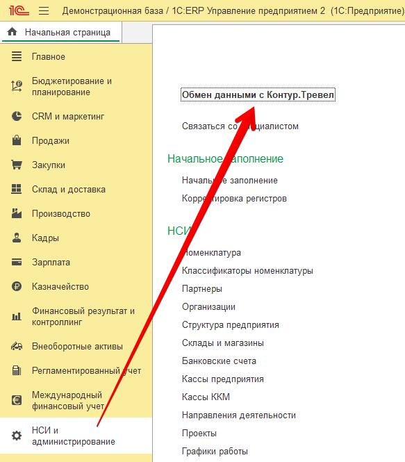

Использование
=============

Перед началом использования необходимо задать настройки подключения к сервису.
Детали подключения необходимо получить в сервисе.

Настройка подключения
---------------------

.. raw:: html
   
   

      <iframe 
            width="560" 
            height="315" 
            src="https://www.youtube-nocookie.com/embed/hf9k3ev3eZU" 
            title="YouTube video player" 
            frameborder="0" 
            allow="accelerometer; autoplay; clipboard-write; encrypted-media; gyroscope; picture-in-picture" 
            allowfullscreen>
      </iframe>
    

После перезапуска в разделе «Администрирование» должен появиться новый пункт «Обмен данными с Контур.Тревел». Кликнем по нему. 

      Обмен данными с Контур.Тревел

Заполним поля настройки сведениями, выданные сервисом. (необходимо обратиться к менеджеру сервиса)

.. figure:: _static/sshts/09.png
      :align: center

      Заполнение настроек подключения

После сохранения настройки можно приступать к работе с сервисом.

Выгрузка сотрудников
--------------------

Для выгрузки сотрудников в сервис достаточно перейти в одноименный справочник.
В форме списка и элемента справочника должна была появиться кнопка «Выгрузить в Тревел» |кнопка-тревел|.

.. |кнопка-тревел| image:: _static/sshts/05.png

.. raw:: html
   
   

      <iframe 
            width="560" 
            height="315" 
            src="https://www.youtube-nocookie.com/embed/tjKyGdjW_Og" 
            title="YouTube video player" 
            frameborder="0" 
            allow="accelerometer; autoplay; clipboard-write; encrypted-media; gyroscope; picture-in-picture" 
            allowfullscreen>
      </iframe>
    

.. note:: Перед выгрузкой необходимо убедиться, что у физических лиц заполнены:
          
          - Дата, с которой действуют сведения о гражданстве
          - Номер телефона и e-mail
          - Документ, удостоверяющий личность (например, паспорт РФ)

Выберем нескольких сотрудников (например, удерживая клавишу ``Shift`` или ``Ctrl``) и нажмем на кнопку «Выгрузить в Тревел»

.. figure:: _static/sshts/10.png
      :align: center

      Выгрузка сотрудников

Аналогично можно выгружать по одному из карточки сотрудника.

Выгрузка сотрудников по расписанию
----------------------------------

С целью автоматизации процесса отправки сотрудников в сервис, можно настроить расписание выгрузки.

Для настройки следует открыть форму с параметрами подключения (см. Настройка подключения) и активировать выключатель «Расписание»

В открывшемся окне задать параметры расписания.

.. figure:: _static/sshts/11.png
      :align: center

      Параметры выгрузки по расписанию